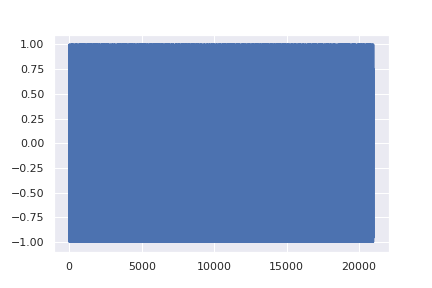
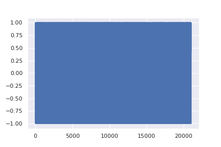

# CRASH: Raw Audio Score-based Generative Modeling for Controllable High-resolution Drum Sound Synthesis

This repo contains a PyTorch implementation for the paper [CRASH: Raw Audio Score-based Generative Modeling for Controllable High-resolution Drum Sound Synthesis](https://arxiv.org/abs/2106.07431) 
by [Simon Rouard](https://github.com/simonrouard) and [Gaëtan Hadjeres](https://github.com/Ghadjeres) accepted at [ISMIR 2021](https://ismir2021.ismir.net). 
You can hear some material on [this link](https://crash-diffusion.github.io/crash/).
--------------------

 


We propose to use the [continuous framework of diffusion models](https://arxiv.org/abs/2011.13456) to the task of unconditional audio generation on drum sounds. 

Moreover, the flexibility of diffusion models lets us perform sound design on drums such as : regeneration of variations of a sound, class-conditional/class mixing 
generation, interpolations between sounds or inpainting. By using the latent representation given by the forward Ordinary Differential Equation, you can also load 
any 44.1kHz drum sound and manipulate it. It has to be of length 21.000 if you use the pretrained checkpoints provided.  


## Requirements
Run the following line in your terminal in order to install all the requirements
```sh
pip install -r requirements.txt
```

## What is in the repo?
* All the python files excepts `inference.py`, `model_classifier.py` and `inference_notebook.ipynb` are dedicated to the training of the model on a mono sound dataset. 
To train a model, you need to adapt the `params.py` file to your configuration. Then, you just have to run:
```sh
python3 __main__.py
```
You can monitor the model during training by running:
`tensorboard --logdir weights` (if you chose 'weights' as 'model_dir' in the `params.py` file)
* The file `model_classifier.py` contains the architecture of the noise conditioned classifier necessary to the class-conditional generations. It has only been trained on VP SDEs.
* The file `inference.py` contains all the types of sampling. See the Jupyter Notebook `inference_notebook.ipynb` to understand all the possibilities that the model offers. 

## Checkpoints of the model

You can download the folder with the saved weights on this [link](https://drive.google.com/drive/folders/1UFVVnTFDmPSdzwuV_1GIVBW4BoJWKaFm?usp=sharing).
Then, put the folder `saved_weights` in your repository so that the notebook works well. 

## How to extend the code?
* New SDEs: you can train the model with a new SDE by creating a new class in the `sde.py` file. It must contain the functions sigma(t), mean(t), beta(t) and g(t) which are linked in the Appendix D of the paper, formula (33). 
